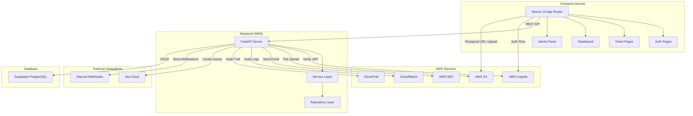
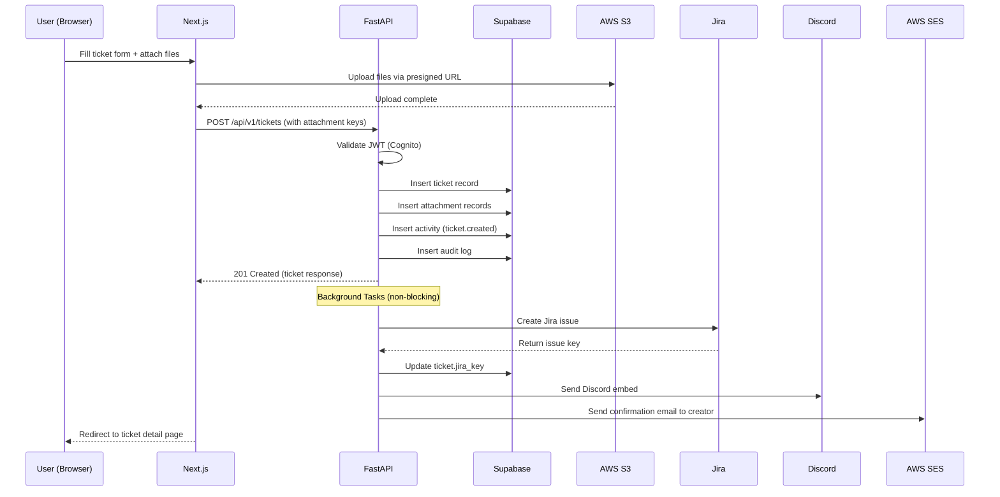
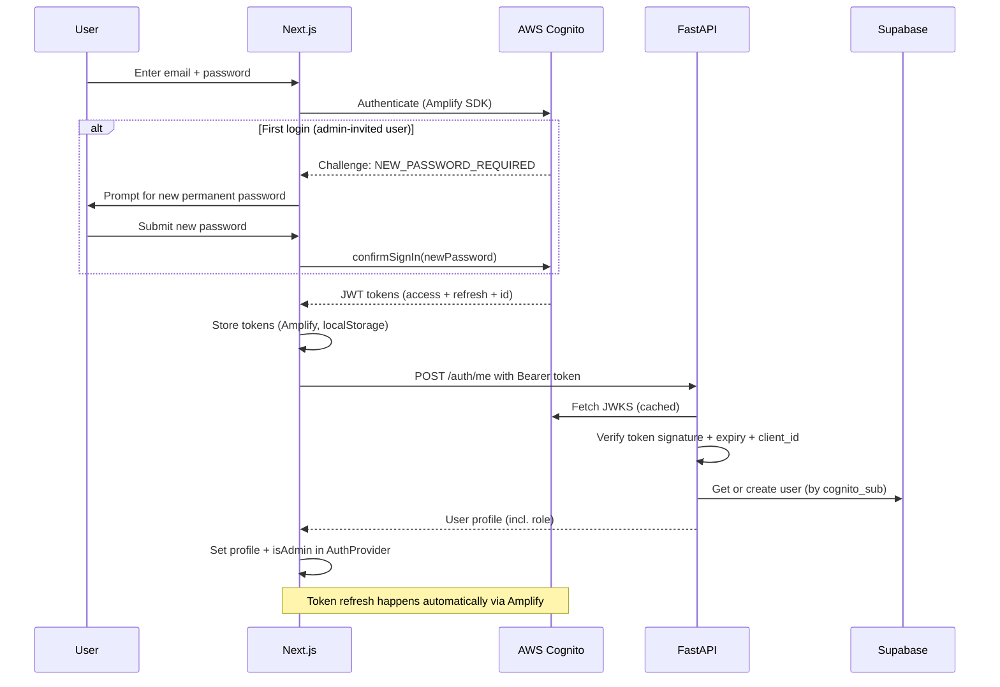
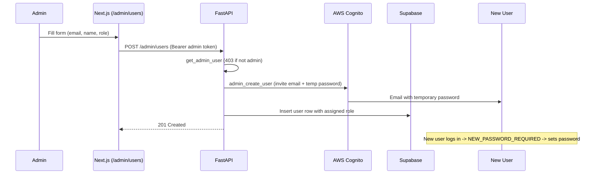
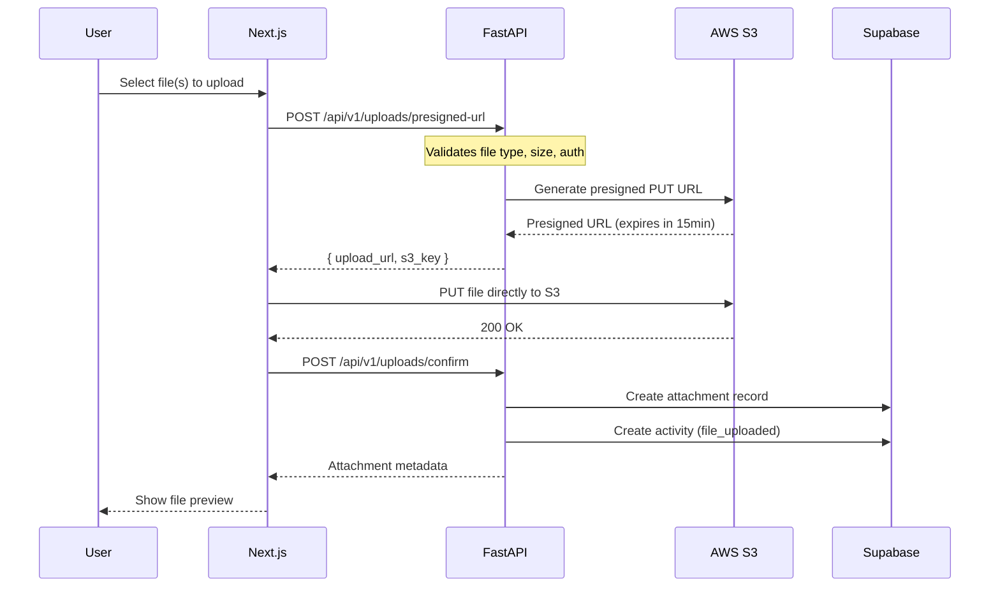
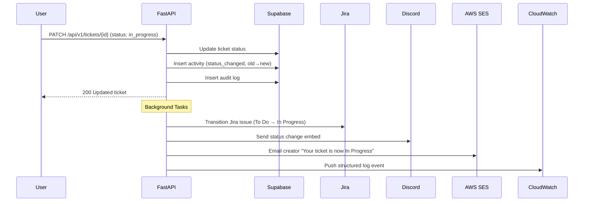
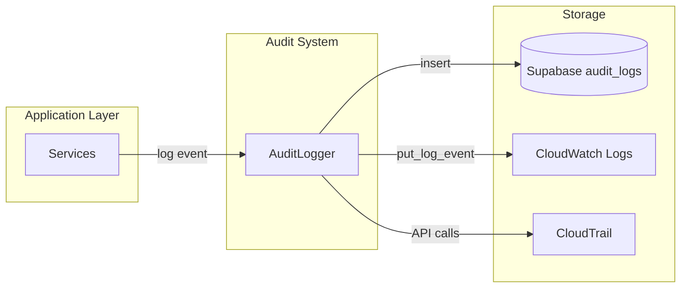
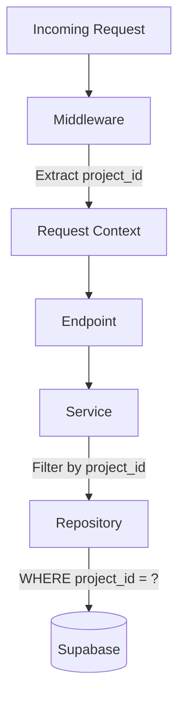
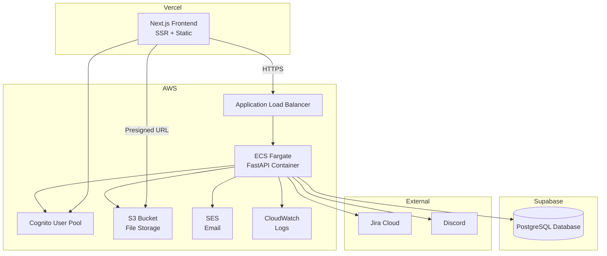

# Support System - Architecture Document

## System Overview



---

## Component Breakdown

### Frontend (Next.js 14)

| Component | Responsibility |
|-----------|---------------|
| `(auth)/` route group | Login, Signup pages — public, minimal layout |
| `(protected)/` route group | Dashboard, Tickets, Admin — requires auth, full app layout |
| `(public)/` route group | Public insights dashboard — no auth, read-only |
| `components/ui/` | Reusable primitives (Button, Input, Modal, Badge, Toast) |
| `components/charts/` | KPI cards, Recharts wrappers |
| `components/tickets/` | TicketForm, TicketTable, TicketTimeline, BulkActionBar |
| `components/search/` | SearchBar, FilterPanel, SavedFilters |
| `components/layout/` | Sidebar, Navbar, ProjectSelector |
| `lib/api.ts` | Authenticated fetch wrapper for backend API |
| `lib/cognito.ts` | AWS Amplify/Cognito configuration |
| `providers/` | AuthProvider, QueryProvider (React Query) |
| `middleware.ts` | Route protection based on auth state |

### Backend (FastAPI)

| Layer | Responsibility |
|-------|---------------|
| `api/v1/endpoints/` | HTTP handlers — request parsing, response formatting |
| `schemas/` | Pydantic request/response models with validation |
| `services/` | Business logic — orchestrates repos + integrations |
| `db/repositories/` | Data access — Supabase queries, pagination |
| `integrations/` | External service clients (Jira, Discord, AWS) |
| `core/` | Cross-cutting: security, exceptions, logging, middleware |
| `audit/` | Audit event logging to DB + CloudWatch |
| `models/` | Domain models and enums |

### Architecture Pattern

```
Request → Endpoint (Router) → Service → Repository → Supabase
                                  ↓
                           Integrations (Background)
                           ├── Jira (create/transition)
                           ├── Discord (webhook)
                           ├── SES (email)
                           └── Audit (CloudWatch + DB)
```

---

## Data Flow Diagrams

### Ticket Creation Flow



### Authentication Model: Admin-Only User Creation

Public self-signup is **disabled** (`AllowAdminCreateUserOnly = true` on the
Cognito pool). Users are created only by admins.

- **First admin:** created once via `bootstrap_admin.py` (Cognito user with a
  permanent password + Supabase row with `role=admin`).
- **All other users:** created by an admin via `POST /admin/users`. Cognito
  emails a temporary password; the user sets a permanent one on first login.
- **Admins can create admins** by selecting `role=admin` at creation time.

### Login Flow



### Admin Creates User Flow



### File Upload Flow



### Status Change Flow (with Integrations)



---

## Integration Patterns

### Jira Integration

```
┌─────────────────────────────────────────────────┐
│ integrations/jira/                              │
├─────────────────────────────────────────────────┤
│ client.py  → Low-level REST API calls (httpx)   │
│              - create_issue()                    │
│              - transition_issue()                │
│              - get_issue()                       │
├─────────────────────────────────────────────────┤
│ service.py → Business logic                     │
│              - sync_ticket_to_jira()            │
│              - sync_status_to_jira()            │
│              - map_status_to_transition()        │
└─────────────────────────────────────────────────┘

Status Mapping:
  pending      → To Do
  in_progress  → In Progress
  paused       → On Hold
  in_review    → In Review
  completed    → Done
```

### Discord Integration

```
┌─────────────────────────────────────────────────┐
│ integrations/discord/                           │
├─────────────────────────────────────────────────┤
│ client.py  → Webhook HTTP calls                 │
│              - send_embed()                      │
├─────────────────────────────────────────────────┤
│ service.py → Message construction               │
│              - notify_ticket_created()           │
│              - notify_status_changed()           │
│              - build_embed() (color by priority) │
└─────────────────────────────────────────────────┘

Embed Colors:
  critical → Red (#FF0000)
  high     → Orange (#FF8C00)
  medium   → Yellow (#FFD700)
  low      → Green (#00C853)
```

### AWS SES (Email)

```
┌─────────────────────────────────────────────────┐
│ integrations/aws/ses.py                         │
├─────────────────────────────────────────────────┤
│ - send_template_email()                         │
│ - Templates: status_changed, assigned,          │
│   completed                                     │
│ - Respects user.email_notifications flag        │
└─────────────────────────────────────────────────┘
```

---

## Audit Logging Architecture



### Audit Event Structure

```json
{
  "actor_id": "uuid",
  "action": "ticket.status_changed",
  "resource_type": "ticket",
  "resource_id": "uuid",
  "project_id": "uuid",
  "metadata": {
    "old_status": "pending",
    "new_status": "in_progress"
  },
  "ip_address": "1.2.3.4",
  "timestamp": "2024-01-15T10:30:00Z"
}
```

### CloudWatch Log Format

```json
{
  "level": "INFO",
  "timestamp": "2024-01-15T10:30:00Z",
  "service": "support-system",
  "event": "ticket.status_changed",
  "actor": "user@email.com",
  "resource": "ticket:uuid",
  "project": "project-name",
  "details": {}
}
```

---

## Multi-Tenant / Multi-Project Design



### How it Works

1. **Project Context Injection:** Middleware extracts `X-Project-ID` header or gets it from the user's active project
2. **Dependency Injection:** `get_current_project()` FastAPI dependency provides project_id to all endpoints
3. **Repository Scoping:** All queries include `project_id` filter automatically
4. **Admin Override:** Admin users can query across all projects (for dashboard aggregation)

### Data Isolation

- Tickets belong to a project
- Attachments belong to a ticket (transitive project scope)
- Activities belong to a ticket (transitive project scope)
- Audit logs are tagged with project_id
- S3 keys are namespaced: `{project_id}/{ticket_id}/...`
- Jira + Discord configs are per-project

---

## Security Architecture

```
┌────────────────────────────────────────────────────────┐
│ Security Layers                                         │
├────────────────────────────────────────────────────────┤
│ 1. AWS Cognito (Identity + Token issuance)             │
│ 2. JWT Verification (every request)                    │
│ 3. Role-based access (admin vs user)                   │
│ 4. Project-level authorization                         │
│ 5. Input validation (Pydantic schemas)                 │
│ 6. File type/size validation (uploads)                 │
│ 7. Rate limiting (public endpoints)                    │
│ 8. CORS configuration (allowed origins)                │
│ 9. Audit trail (all mutations logged)                  │
└────────────────────────────────────────────────────────┘
```

---

## Deployment Architecture


