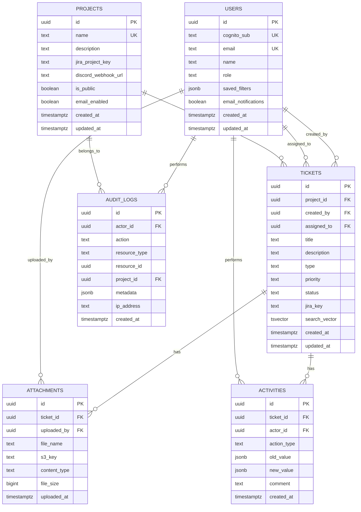

# Support System - Database Schema

## Overview

Database: **Supabase (PostgreSQL 15+)**

All tables use UUID primary keys generated with `gen_random_uuid()`. Timestamps use `timestamptz` (timezone-aware).

---

## Entity Relationship Diagram



---

## Table Definitions

### 1. users

| Column | Type | Constraints | Description |
|--------|------|-------------|-------------|
| id | uuid | PK, DEFAULT gen_random_uuid() | Unique identifier |
| cognito_sub | text | UNIQUE, NOT NULL | AWS Cognito user sub ID |
| email | text | UNIQUE, NOT NULL | User email |
| name | text | NOT NULL | Display name |
| role | text | NOT NULL, DEFAULT 'user' | 'admin' or 'user' |
| saved_filters | jsonb | DEFAULT '[]' | User's saved search filters |
| email_notifications | boolean | DEFAULT true | Whether to receive email notifications |
| created_at | timestamptz | DEFAULT now() | Account creation time |
| updated_at | timestamptz | DEFAULT now() | Last update time |

### 2. projects

| Column | Type | Constraints | Description |
|--------|------|-------------|-------------|
| id | uuid | PK, DEFAULT gen_random_uuid() | Unique identifier |
| name | text | UNIQUE, NOT NULL | Project name |
| description | text | | Project description |
| jira_project_key | text | | Jira project key (e.g., "ALPHA") |
| discord_webhook_url | text | | Discord channel webhook URL |
| is_public | boolean | DEFAULT false | Whether visible on public dashboard |
| email_enabled | boolean | DEFAULT true | Whether to send email notifications |
| created_at | timestamptz | DEFAULT now() | Creation time |
| updated_at | timestamptz | DEFAULT now() | Last update time |

### 3. tickets

| Column | Type | Constraints | Description |
|--------|------|-------------|-------------|
| id | uuid | PK, DEFAULT gen_random_uuid() | Unique identifier |
| project_id | uuid | FK → projects(id) ON DELETE CASCADE, NOT NULL | Parent project |
| created_by | uuid | FK → users(id), NOT NULL | Ticket creator |
| assigned_to | uuid | FK → users(id) | Assigned user (nullable) |
| title | text | NOT NULL, CHECK length >= 5 | Ticket title |
| description | text | NOT NULL | Ticket description |
| type | text | NOT NULL, CHECK in enum | technical_error, bug, feature, remove |
| priority | text | NOT NULL, CHECK in enum | critical, high, medium, low |
| status | text | NOT NULL, DEFAULT 'pending', CHECK in enum | pending, in_progress, paused, in_review, completed |
| jira_key | text | | Linked Jira issue key |
| search_vector | tsvector | | Full-text search vector (auto-generated) |
| created_at | timestamptz | DEFAULT now() | Creation time |
| updated_at | timestamptz | DEFAULT now() | Last update time |

### 4. attachments

| Column | Type | Constraints | Description |
|--------|------|-------------|-------------|
| id | uuid | PK, DEFAULT gen_random_uuid() | Unique identifier |
| ticket_id | uuid | FK → tickets(id) ON DELETE CASCADE, NOT NULL | Parent ticket |
| uploaded_by | uuid | FK → users(id), NOT NULL | Who uploaded |
| file_name | text | NOT NULL | Original file name |
| s3_key | text | NOT NULL, UNIQUE | S3 object key |
| content_type | text | NOT NULL | MIME type |
| file_size | bigint | NOT NULL | Size in bytes |
| uploaded_at | timestamptz | DEFAULT now() | Upload time |

### 5. activities

| Column | Type | Constraints | Description |
|--------|------|-------------|-------------|
| id | uuid | PK, DEFAULT gen_random_uuid() | Unique identifier |
| ticket_id | uuid | FK → tickets(id) ON DELETE CASCADE, NOT NULL | Parent ticket |
| actor_id | uuid | FK → users(id), NOT NULL | Who performed the action |
| action_type | text | NOT NULL, CHECK in enum | created, status_changed, updated, commented, file_uploaded, file_deleted, assigned |
| old_value | jsonb | | Previous value (for changes) |
| new_value | jsonb | | New value (for changes) |
| comment | text | | Comment text (for commented type) |
| created_at | timestamptz | DEFAULT now() | When it happened |

### 6. audit_logs

| Column | Type | Constraints | Description |
|--------|------|-------------|-------------|
| id | uuid | PK, DEFAULT gen_random_uuid() | Unique identifier |
| actor_id | uuid | FK → users(id), NOT NULL | Who performed the action |
| action | text | NOT NULL | Action identifier (e.g., ticket.created) |
| resource_type | text | NOT NULL | Resource type: ticket, project, user |
| resource_id | uuid | NOT NULL | ID of the affected resource |
| project_id | uuid | FK → projects(id) | Associated project |
| metadata | jsonb | DEFAULT '{}' | Additional context |
| ip_address | text | | Request IP address |
| created_at | timestamptz | DEFAULT now() | When it happened |

---

## Indexes

```sql
-- Users
CREATE UNIQUE INDEX idx_users_cognito_sub ON users(cognito_sub);
CREATE UNIQUE INDEX idx_users_email ON users(email);

-- Tickets
CREATE INDEX idx_tickets_project_id ON tickets(project_id);
CREATE INDEX idx_tickets_project_status ON tickets(project_id, status);
CREATE INDEX idx_tickets_created_by ON tickets(created_by);
CREATE INDEX idx_tickets_assigned_to ON tickets(assigned_to);
CREATE INDEX idx_tickets_priority ON tickets(priority);
CREATE INDEX idx_tickets_type ON tickets(type);
CREATE INDEX idx_tickets_created_at ON tickets(created_at DESC);
CREATE INDEX idx_tickets_search_vector ON tickets USING GIN(search_vector);

-- Attachments
CREATE INDEX idx_attachments_ticket_id ON attachments(ticket_id);

-- Activities
CREATE INDEX idx_activities_ticket_id ON activities(ticket_id);
CREATE INDEX idx_activities_created_at ON activities(created_at DESC);

-- Audit Logs
CREATE INDEX idx_audit_logs_actor_id ON audit_logs(actor_id);
CREATE INDEX idx_audit_logs_project_id ON audit_logs(project_id);
CREATE INDEX idx_audit_logs_action ON audit_logs(action);
CREATE INDEX idx_audit_logs_resource ON audit_logs(resource_type, resource_id);
CREATE INDEX idx_audit_logs_created_at ON audit_logs(created_at DESC);
```

---

## Full-Text Search Configuration

```sql
-- Create search vector trigger function
CREATE OR REPLACE FUNCTION tickets_search_vector_update() RETURNS trigger AS $$
BEGIN
  NEW.search_vector :=
    setweight(to_tsvector('english', COALESCE(NEW.title, '')), 'A') ||
    setweight(to_tsvector('english', COALESCE(NEW.description, '')), 'B');
  RETURN NEW;
END;
$$ LANGUAGE plpgsql;

-- Trigger to auto-update search_vector on insert/update
CREATE TRIGGER tickets_search_vector_trigger
  BEFORE INSERT OR UPDATE OF title, description ON tickets
  FOR EACH ROW
  EXECUTE FUNCTION tickets_search_vector_update();
```

---

## Auto-Update Timestamps

```sql
-- Function to auto-update updated_at
CREATE OR REPLACE FUNCTION update_updated_at_column() RETURNS trigger AS $$
BEGIN
  NEW.updated_at = now();
  RETURN NEW;
END;
$$ LANGUAGE plpgsql;

-- Apply to tables with updated_at
CREATE TRIGGER update_users_updated_at
  BEFORE UPDATE ON users
  FOR EACH ROW EXECUTE FUNCTION update_updated_at_column();

CREATE TRIGGER update_projects_updated_at
  BEFORE UPDATE ON projects
  FOR EACH ROW EXECUTE FUNCTION update_updated_at_column();

CREATE TRIGGER update_tickets_updated_at
  BEFORE UPDATE ON tickets
  FOR EACH ROW EXECUTE FUNCTION update_updated_at_column();
```

---

## Enum Check Constraints

```sql
-- Ticket status
ALTER TABLE tickets ADD CONSTRAINT chk_ticket_status
  CHECK (status IN ('pending', 'in_progress', 'paused', 'in_review', 'completed'));

-- Ticket type
ALTER TABLE tickets ADD CONSTRAINT chk_ticket_type
  CHECK (type IN ('technical_error', 'bug', 'feature', 'remove'));

-- Ticket priority
ALTER TABLE tickets ADD CONSTRAINT chk_ticket_priority
  CHECK (priority IN ('critical', 'high', 'medium', 'low'));

-- User role
ALTER TABLE users ADD CONSTRAINT chk_user_role
  CHECK (role IN ('admin', 'user'));

-- Activity action type
ALTER TABLE activities ADD CONSTRAINT chk_activity_action_type
  CHECK (action_type IN ('created', 'status_changed', 'updated', 'commented', 'file_uploaded', 'file_deleted', 'assigned'));
```

---

## Complete Migration SQL

```sql
-- ============================================================
-- SUPPORT SYSTEM DATABASE MIGRATION
-- ============================================================

-- Enable UUID extension
CREATE EXTENSION IF NOT EXISTS "uuid-ossp";

-- ============================================================
-- TABLES
-- ============================================================

-- 1. Users
CREATE TABLE users (
  id uuid PRIMARY KEY DEFAULT gen_random_uuid(),
  cognito_sub text UNIQUE NOT NULL,
  email text UNIQUE NOT NULL,
  name text NOT NULL,
  role text NOT NULL DEFAULT 'user'
    CHECK (role IN ('admin', 'user')),
  saved_filters jsonb DEFAULT '[]'::jsonb,
  email_notifications boolean DEFAULT true,
  created_at timestamptz DEFAULT now(),
  updated_at timestamptz DEFAULT now()
);

-- 2. Projects
CREATE TABLE projects (
  id uuid PRIMARY KEY DEFAULT gen_random_uuid(),
  name text UNIQUE NOT NULL,
  description text,
  jira_project_key text,
  discord_webhook_url text,
  is_public boolean DEFAULT false,
  email_enabled boolean DEFAULT true,
  created_at timestamptz DEFAULT now(),
  updated_at timestamptz DEFAULT now()
);

-- 3. Tickets
CREATE TABLE tickets (
  id uuid PRIMARY KEY DEFAULT gen_random_uuid(),
  project_id uuid NOT NULL REFERENCES projects(id) ON DELETE CASCADE,
  created_by uuid NOT NULL REFERENCES users(id),
  assigned_to uuid REFERENCES users(id),
  title text NOT NULL CHECK (length(title) >= 5),
  description text NOT NULL,
  type text NOT NULL
    CHECK (type IN ('technical_error', 'bug', 'feature', 'remove')),
  priority text NOT NULL
    CHECK (priority IN ('critical', 'high', 'medium', 'low')),
  status text NOT NULL DEFAULT 'pending'
    CHECK (status IN ('pending', 'in_progress', 'paused', 'in_review', 'completed')),
  jira_key text,
  search_vector tsvector,
  created_at timestamptz DEFAULT now(),
  updated_at timestamptz DEFAULT now()
);

-- 4. Attachments
CREATE TABLE attachments (
  id uuid PRIMARY KEY DEFAULT gen_random_uuid(),
  ticket_id uuid NOT NULL REFERENCES tickets(id) ON DELETE CASCADE,
  uploaded_by uuid NOT NULL REFERENCES users(id),
  file_name text NOT NULL,
  s3_key text UNIQUE NOT NULL,
  content_type text NOT NULL,
  file_size bigint NOT NULL,
  uploaded_at timestamptz DEFAULT now()
);

-- 5. Activities
CREATE TABLE activities (
  id uuid PRIMARY KEY DEFAULT gen_random_uuid(),
  ticket_id uuid NOT NULL REFERENCES tickets(id) ON DELETE CASCADE,
  actor_id uuid NOT NULL REFERENCES users(id),
  action_type text NOT NULL
    CHECK (action_type IN ('created', 'status_changed', 'updated', 'commented', 'file_uploaded', 'file_deleted', 'assigned')),
  old_value jsonb,
  new_value jsonb,
  comment text,
  created_at timestamptz DEFAULT now()
);

-- 6. Audit Logs
CREATE TABLE audit_logs (
  id uuid PRIMARY KEY DEFAULT gen_random_uuid(),
  actor_id uuid NOT NULL REFERENCES users(id),
  action text NOT NULL,
  resource_type text NOT NULL,
  resource_id uuid NOT NULL,
  project_id uuid REFERENCES projects(id),
  metadata jsonb DEFAULT '{}'::jsonb,
  ip_address text,
  created_at timestamptz DEFAULT now()
);

-- ============================================================
-- INDEXES
-- ============================================================

CREATE INDEX idx_tickets_project_id ON tickets(project_id);
CREATE INDEX idx_tickets_project_status ON tickets(project_id, status);
CREATE INDEX idx_tickets_created_by ON tickets(created_by);
CREATE INDEX idx_tickets_assigned_to ON tickets(assigned_to);
CREATE INDEX idx_tickets_priority ON tickets(priority);
CREATE INDEX idx_tickets_type ON tickets(type);
CREATE INDEX idx_tickets_created_at ON tickets(created_at DESC);
CREATE INDEX idx_tickets_search_vector ON tickets USING GIN(search_vector);

CREATE INDEX idx_attachments_ticket_id ON attachments(ticket_id);

CREATE INDEX idx_activities_ticket_id ON activities(ticket_id);
CREATE INDEX idx_activities_created_at ON activities(created_at DESC);

CREATE INDEX idx_audit_logs_actor_id ON audit_logs(actor_id);
CREATE INDEX idx_audit_logs_project_id ON audit_logs(project_id);
CREATE INDEX idx_audit_logs_action ON audit_logs(action);
CREATE INDEX idx_audit_logs_resource ON audit_logs(resource_type, resource_id);
CREATE INDEX idx_audit_logs_created_at ON audit_logs(created_at DESC);

-- ============================================================
-- FUNCTIONS & TRIGGERS
-- ============================================================

-- Auto-update updated_at
CREATE OR REPLACE FUNCTION update_updated_at_column() RETURNS trigger AS $$
BEGIN
  NEW.updated_at = now();
  RETURN NEW;
END;
$$ LANGUAGE plpgsql;

CREATE TRIGGER update_users_updated_at
  BEFORE UPDATE ON users
  FOR EACH ROW EXECUTE FUNCTION update_updated_at_column();

CREATE TRIGGER update_projects_updated_at
  BEFORE UPDATE ON projects
  FOR EACH ROW EXECUTE FUNCTION update_updated_at_column();

CREATE TRIGGER update_tickets_updated_at
  BEFORE UPDATE ON tickets
  FOR EACH ROW EXECUTE FUNCTION update_updated_at_column();

-- Full-text search vector auto-update
CREATE OR REPLACE FUNCTION tickets_search_vector_update() RETURNS trigger AS $$
BEGIN
  NEW.search_vector :=
    setweight(to_tsvector('english', COALESCE(NEW.title, '')), 'A') ||
    setweight(to_tsvector('english', COALESCE(NEW.description, '')), 'B');
  RETURN NEW;
END;
$$ LANGUAGE plpgsql;

CREATE TRIGGER tickets_search_vector_trigger
  BEFORE INSERT OR UPDATE OF title, description ON tickets
  FOR EACH ROW
  EXECUTE FUNCTION tickets_search_vector_update();

-- ============================================================
-- ROW LEVEL SECURITY (RLS)
-- ============================================================

-- Enable RLS on all tables
ALTER TABLE users ENABLE ROW LEVEL SECURITY;
ALTER TABLE projects ENABLE ROW LEVEL SECURITY;
ALTER TABLE tickets ENABLE ROW LEVEL SECURITY;
ALTER TABLE attachments ENABLE ROW LEVEL SECURITY;
ALTER TABLE activities ENABLE ROW LEVEL SECURITY;
ALTER TABLE audit_logs ENABLE ROW LEVEL SECURITY;

-- NOTE: RLS policies depend on how you authenticate with Supabase.
-- If using the service_role key from FastAPI (bypasses RLS), you handle
-- authorization in your application layer instead.
-- 
-- If using anon/authenticated keys, define policies like:
--
-- CREATE POLICY "Users can view own data"
--   ON users FOR SELECT
--   USING (auth.uid()::text = cognito_sub);
--
-- For this project, we use service_role key in FastAPI and handle
-- authorization at the application level (middleware + dependencies).
```

---

## Sample Data (Development)

```sql
-- Insert test users
INSERT INTO users (cognito_sub, email, name, role) VALUES
  ('cognito-sub-001', 'admin@example.com', 'Admin User', 'admin'),
  ('cognito-sub-002', 'john@example.com', 'John Doe', 'user'),
  ('cognito-sub-003', 'jane@example.com', 'Jane Smith', 'user');

-- Insert test projects
INSERT INTO projects (name, description, jira_project_key, is_public) VALUES
  ('Project Alpha', 'Main product support', 'ALPHA', true),
  ('Project Beta', 'Mobile app support', 'BETA', true);

-- Insert test tickets
INSERT INTO tickets (project_id, created_by, title, description, type, priority, status) VALUES
  (
    (SELECT id FROM projects WHERE name = 'Project Alpha'),
    (SELECT id FROM users WHERE email = 'john@example.com'),
    'Login page not loading on Chrome',
    'The login page shows a blank screen when accessed via Chrome v120. Works fine on Firefox.',
    'bug',
    'high',
    'in_progress'
  ),
  (
    (SELECT id FROM projects WHERE name = 'Project Alpha'),
    (SELECT id FROM users WHERE email = 'jane@example.com'),
    'Add dark mode support',
    'Users have requested dark mode. Should follow system preference by default.',
    'feature',
    'medium',
    'pending'
  );
```
