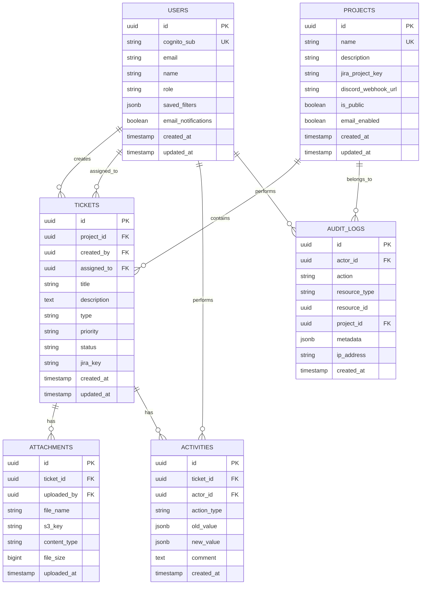

# Support System - Implementation Plan

## Problem Statement

Build a multi-project support ticket system with a Next.js frontend and FastAPI backend, featuring ticket CRUD with file uploads, priority levels, activity timelines, bulk operations, full-text search, email notifications, a public KPI dashboard, Jira/Discord integrations, and comprehensive audit logging via AWS services.

---

## Requirements

### Functional Requirements

1. **Ticket Management**
   - Create, read, update, delete tickets
   - Required fields: Title, Description, Images/Video upload
   - Ticket types: Technical Error, Bug, Feature, Remove
   - Priority levels: Critical, High, Medium, Low
   - Status workflow: Pending → In Progress → Paused → In Review → Completed

2. **Multi-Project Support**
   - Admin panel for creating/managing projects
   - Tickets scoped to projects
   - Per-project Jira and Discord configuration

3. **Pages**
   - Add Ticket page
   - All Tickets page (list, filter, inline status update, bulk ops, delete)
   - Ticket Detail page (with activity timeline)
   - Public Dashboard (KPIs, charts, insights)
   - Protected Dashboard (detailed analytics)
   - Admin Panel (project management, audit logs)

4. **File Uploads**
   - Images (jpg, png, gif, webp) and Videos (mp4, webm)
   - Stored in AWS S3 via presigned URLs
   - Multiple files per ticket
   - Size limit: 50MB per file

5. **Activity Timeline**
   - Log all ticket actions (creation, updates, status changes, file uploads, comments)
   - Display chronological timeline on ticket detail
   - Support adding comments

6. **Bulk Operations**
   - Multi-select tickets
   - Batch status change, assign, delete

7. **Search & Saved Filters**
   - Full-text search across title and description
   - Filter by status, type, priority, assignee, date range
   - Save/load filter combinations per user

8. **Integrations**
   - Jira: Create issue on ticket creation, sync status changes
   - Discord: Send webhook notifications on creation + status changes
   - AWS SES: Email ticket creator on status change

9. **Audit Logging**
   - Record who created/updated/deleted/completed tickets
   - Store in Supabase audit_logs table + AWS CloudWatch
   - CloudTrail for infrastructure-level audit

10. **Dashboard & Insights**
    - Public: Aggregate KPIs (total, by status, by type, by priority, over time)
    - Protected: Velocity, trends, team workload, project comparison

### Non-Functional Requirements

- Authentication via AWS Cognito (JWT)
- Role-based access (Admin, User)
- Responsive design (mobile-friendly)
- Error handling with consistent API response format
- Rate limiting on public endpoints
- Non-blocking integrations (BackgroundTasks)

---

## Tech Stack

| Layer | Technology |
|-------|-----------|
| Frontend | Next.js 14 (App Router) + TypeScript |
| Styling | TailwindCSS |
| Charts | Recharts |
| Backend | FastAPI + Python 3.11+ |
| Validation | Pydantic v2 |
| Database | Supabase (PostgreSQL) |
| Auth | AWS Cognito |
| File Storage | AWS S3 |
| Email | AWS SES |
| Logging | AWS CloudTrail + CloudWatch |
| Jira | Jira REST API v3 (via httpx) |
| Discord | Discord Webhooks |
| HTTP Client | httpx (async) |
| AWS SDK | Boto3 |
| Deployment | Vercel (frontend) + AWS (backend) + Supabase (DB) |

---

## Folder Structure

```
support-system/
├── frontend/
│   ├── public/
│   │   └── assets/
│   ├── src/
│   │   ├── app/
│   │   │   ├── (auth)/
│   │   │   │   ├── login/page.tsx
│   │   │   │   ├── signup/page.tsx
│   │   │   │   └── layout.tsx
│   │   │   ├── (protected)/
│   │   │   │   ├── dashboard/page.tsx
│   │   │   │   ├── tickets/
│   │   │   │   │   ├── page.tsx
│   │   │   │   │   ├── new/page.tsx
│   │   │   │   │   └── [id]/page.tsx
│   │   │   │   ├── admin/
│   │   │   │   │   └── projects/page.tsx
│   │   │   │   └── layout.tsx
│   │   │   ├── (public)/
│   │   │   │   └── insights/page.tsx
│   │   │   ├── layout.tsx
│   │   │   └── globals.css
│   │   ├── components/
│   │   │   ├── ui/
│   │   │   ├── charts/
│   │   │   ├── tickets/
│   │   │   ├── search/
│   │   │   └── layout/
│   │   ├── lib/
│   │   │   ├── api.ts
│   │   │   ├── cognito.ts
│   │   │   └── utils.ts
│   │   ├── hooks/
│   │   │   ├── useAuth.ts
│   │   │   ├── useTickets.ts
│   │   │   ├── useDashboard.ts
│   │   │   └── useSearch.ts
│   │   ├── providers/
│   │   │   ├── AuthProvider.tsx
│   │   │   └── QueryProvider.tsx
│   │   └── types/
│   │       ├── ticket.ts
│   │       ├── project.ts
│   │       └── dashboard.ts
│   ├── tailwind.config.ts
│   ├── next.config.ts
│   ├── tsconfig.json
│   └── package.json
│
├── backend/
│   ├── app/
│   │   ├── __init__.py
│   │   ├── main.py
│   │   ├── config.py
│   │   ├── dependencies.py
│   │   ├── api/
│   │   │   └── v1/
│   │   │       ├── __init__.py
│   │   │       ├── router.py
│   │   │       └── endpoints/
│   │   │           ├── __init__.py
│   │   │           ├── auth.py
│   │   │           ├── tickets.py
│   │   │           ├── projects.py
│   │   │           ├── dashboard.py
│   │   │           ├── uploads.py
│   │   │           ├── search.py
│   │   │           └── bulk.py
│   │   ├── models/
│   │   │   ├── __init__.py
│   │   │   ├── ticket.py
│   │   │   ├── project.py
│   │   │   ├── user.py
│   │   │   ├── attachment.py
│   │   │   ├── activity.py
│   │   │   └── audit.py
│   │   ├── schemas/
│   │   │   ├── __init__.py
│   │   │   ├── ticket.py
│   │   │   ├── project.py
│   │   │   ├── activity.py
│   │   │   ├── search.py
│   │   │   └── common.py
│   │   ├── services/
│   │   │   ├── __init__.py
│   │   │   ├── ticket_service.py
│   │   │   ├── project_service.py
│   │   │   ├── dashboard_service.py
│   │   │   ├── upload_service.py
│   │   │   ├── search_service.py
│   │   │   ├── activity_service.py
│   │   │   ├── notification_service.py
│   │   │   └── bulk_service.py
│   │   ├── integrations/
│   │   │   ├── __init__.py
│   │   │   ├── jira/
│   │   │   │   ├── __init__.py
│   │   │   │   ├── client.py
│   │   │   │   └── service.py
│   │   │   ├── discord/
│   │   │   │   ├── __init__.py
│   │   │   │   ├── client.py
│   │   │   │   └── service.py
│   │   │   ├── aws/
│   │   │   │   ├── __init__.py
│   │   │   │   ├── s3.py
│   │   │   │   ├── cognito.py
│   │   │   │   ├── ses.py
│   │   │   │   └── cloudwatch.py
│   │   │   └── supabase/
│   │   │       ├── __init__.py
│   │   │       └── client.py
│   │   ├── core/
│   │   │   ├── __init__.py
│   │   │   ├── security.py
│   │   │   ├── exceptions.py
│   │   │   ├── logging.py
│   │   │   └── middleware.py
│   │   ├── db/
│   │   │   ├── __init__.py
│   │   │   └── repositories/
│   │   │       ├── __init__.py
│   │   │       ├── base_repo.py
│   │   │       ├── ticket_repo.py
│   │   │       ├── project_repo.py
│   │   │       ├── user_repo.py
│   │   │       ├── activity_repo.py
│   │   │       └── audit_repo.py
│   │   └── audit/
│   │       ├── __init__.py
│   │       ├── logger.py
│   │       └── events.py
│   ├── tests/
│   │   ├── __init__.py
│   │   ├── conftest.py
│   │   ├── api/
│   │   ├── services/
│   │   └── integrations/
│   ├── pyproject.toml
│   ├── Dockerfile
│   └── .env.example
│
├── docker-compose.yml
├── docs/
│   ├── IMPLEMENTATION_PLAN.md
│   ├── ARCHITECTURE.md
│   ├── BUILD_SEQUENCE.md
│   ├── API_SPEC.md
│   └── DATABASE_SCHEMA.md
└── README.md
```

---

## Database Schema



### Enums

**Status:** `pending`, `in_progress`, `paused`, `in_review`, `completed`

**Type:** `technical_error`, `bug`, `feature`, `remove`

**Priority:** `critical`, `high`, `medium`, `low`

**Role:** `admin`, `user`

**Activity Action Type:** `created`, `status_changed`, `updated`, `commented`, `file_uploaded`, `file_deleted`, `assigned`

---

## Task Breakdown

### Task 1: Project Scaffolding & Configuration

**Objective:** Set up the monorepo with Next.js and FastAPI boilerplates, full folder structure, Docker Compose, and environment configuration.

**Implementation Guidance:**
- Initialize Next.js 14 with App Router, TailwindCSS, TypeScript via `create-next-app`
- Initialize FastAPI with `pyproject.toml` (dependencies: fastapi, uvicorn, pydantic-settings, supabase, boto3, httpx, python-jose)
- Create all directories and placeholder files per the folder structure
- Set up `docker-compose.yml` with frontend (port 3000) and backend (port 8000) services
- Configure pydantic-settings `config.py` with all required env vars
- Set up CORS middleware in FastAPI
- Create `.env.example` for both projects
- Add health check endpoint

**Test Requirements:** `docker-compose up` runs both services. `GET /health` returns 200. Next.js renders placeholder page.

**Demo:** Run `docker-compose up`, visit both services, confirm they're running.

---

### Task 2: Supabase Database Setup & Repository Layer

**Objective:** Create all database tables in Supabase and implement the repository pattern for data access.

**Implementation Guidance:**
- Write SQL migration scripts for: users, projects, tickets, attachments, activities, audit_logs
- Add indexes: tickets(project_id, status), tickets(created_by), activities(ticket_id), full-text search on tickets(title, description)
- Set up `supabase-py` client singleton
- Implement `BaseRepository` with generic CRUD
- Implement specific repositories extending base
- Add pagination helper (offset/limit with total count)

**Test Requirements:** Unit tests for each repository with mocked Supabase client.

**Demo:** Tests passing. Tables visible in Supabase dashboard.

---

### Task 3: AWS Cognito Authentication (Admin-Only User Creation) ✅

**Objective:** Implement JWT-based auth using AWS Cognito — token verification in FastAPI and full auth flow in Next.js. **User creation is admin-only** — public self-signup is disabled.

**Auth Model:**
- Cognito pool is configured with `AllowAdminCreateUserOnly = true` (no public signup).
- The **first admin** is created out-of-band via `bootstrap_admin.py` (creates the Cognito user with a permanent password + a Supabase row with `role=admin`).
- After that, **admins create all other users** (admin or regular) via `POST /admin/users`. Cognito emails the new user a temporary password.
- On first login, invited users are forced to set a permanent password (`CONFIRM_SIGN_IN_WITH_NEW_PASSWORD_REQUIRED`).
- **Admins can create other admins** by choosing `role = admin` at creation.

**Implementation Guidance:**
- Backend: JWKS fetch + cache, verify token signature/expiry/issuer (`CognitoVerifier`)
- Backend: `get_current_user` / `get_admin_user` dependencies
- Backend: Get-or-create user in Supabase on first authenticated request
- Backend: `CognitoAdmin` (boto3) for `admin_create_user` / delete / set password
- Backend: Admin user endpoints — `GET/POST /admin/users`, `PATCH /admin/users/{id}/role`
- Backend: `bootstrap_admin.py` one-time script for the first admin
- Frontend: AWS Amplify v6 config, AuthProvider (exposes `profile`, `isAdmin`)
- Frontend: Login page with new-password challenge; signup page disabled (contact-admin notice)
- Frontend: Navbar with role badge + logout; Sidebar with role-gated admin nav
- Frontend: `/admin/users` page — list users, create user with role dropdown

**Test Requirements:** Test valid/invalid/expired tokens (401). Test admin can create users/admins. Test non-admins are rejected (403) from admin endpoints.

**Demo:** Admin logs in, sees admin badge, opens Users page, creates a new user/admin with role dropdown. Invited user logs in with temp password and sets a permanent one. Non-admins don't see admin nav.

---

### Task 4: Project Management (Admin Panel)

**Objective:** Build CRUD for projects and the admin UI with project context.

**Implementation Guidance:**
- Backend: Project CRUD endpoints (admin-only create/edit/delete)
- Backend: Project context middleware/dependency
- Frontend: Admin projects page (table, add/edit/delete forms)
- Frontend: ProjectSelector in sidebar
- Persist selected project in localStorage

**Test Requirements:** Test project CRUD. Test admin-only access. Test project context injection.

**Demo:** Admin creates projects, user switches between them in sidebar.

---

### Task 5: Ticket CRUD & Add Ticket Page

**Objective:** Implement full ticket CRUD API and the "Add Ticket" form.

**Implementation Guidance:**
- Backend: TicketService (create, read, update, delete, list)
- Backend: Enum validation (type, priority, status)
- Frontend: `/tickets/new` page with Title, Description, Type, Priority
- Frontend: Client-side validation
- Status defaults to "pending" on creation

**Test Requirements:** Test CRUD endpoints. Test validation. Test project scoping.

**Demo:** User creates ticket, gets redirected to detail page.

---

### Task 6: File Upload to AWS S3

**Objective:** Add image/video attachment support using S3 presigned URLs.

**Implementation Guidance:**
- Backend: Presigned URL generation, attachment CRUD
- Backend: File type/size validation
- Frontend: Drag-and-drop upload with progress
- Frontend: Image/video preview
- S3 key pattern: `{project_id}/{ticket_id}/{uuid}/{filename}`

**Test Requirements:** Test URL generation. Test validation. Test attachment CRUD.

**Demo:** User attaches files, sees preview, can delete.

---

### Task 7: Activity Timeline

**Objective:** Record all ticket actions and display chronological timeline.

**Implementation Guidance:**
- Backend: Auto-log activities on every ticket mutation
- Backend: Comment endpoint
- Frontend: TicketTimeline component
- Frontend: Comment input box

**Test Requirements:** Test auto-generation. Test comment creation. Test chronological order.

**Demo:** All actions appear in timeline on ticket detail page.

---

### Task 8: All Tickets Page

**Objective:** Build ticket list with table, filters, inline status, and delete.

**Implementation Guidance:**
- Backend: List endpoint with filters, pagination, sorting
- Frontend: Ticket table with sortable columns
- Frontend: Filter bar, inline status dropdown
- Frontend: Delete with confirmation

**Test Requirements:** Test filtering, pagination, inline status update.

**Demo:** User filters tickets, changes status inline, deletes a ticket.

---

### Task 9: Search & Saved Filters

**Objective:** Full-text search + saved filter combinations per user.

**Implementation Guidance:**
- Backend: PostgreSQL full-text search (tsvector)
- Backend: Saved filters CRUD (per user)
- Frontend: Debounced search bar
- Frontend: Save/load/delete filters

**Test Requirements:** Test search results. Test saved filter CRUD.

**Demo:** Search works, user saves and loads filters.

---

### Task 10: Bulk Operations

**Objective:** Multi-select tickets with batch actions.

**Implementation Guidance:**
- Backend: Bulk status change, assign, delete endpoints
- Frontend: Checkbox selection, BulkActionBar
- Frontend: Confirmation modals

**Test Requirements:** Test bulk operations. Test activity logging per item.

**Demo:** Select multiple tickets, bulk change status, bulk delete.

---

### Task 11: Jira Integration

**Objective:** Auto-create Jira issues and sync status changes.

**Implementation Guidance:**
- Backend: Jira httpx client (create, transition, get)
- Backend: Status mapping (pending→To Do, in_progress→In Progress, paused→On Hold, in_review→In Review, completed→Done)
- Backend: BackgroundTasks, graceful failure
- Frontend: Show Jira key/link on ticket

**Test Requirements:** Test payload format. Test status mapping. Test graceful failure.

**Demo:** Create ticket → Jira issue created. Change status → Jira transitions.

---

### Task 12: Discord Integration

**Objective:** Send Discord webhook notifications on ticket events.

**Implementation Guidance:**
- Backend: Discord webhook client with rich embeds
- Backend: Color-coded by priority
- Backend: Per-project webhook URL
- Backend: BackgroundTasks, graceful failure

**Test Requirements:** Test embed format. Test per-project routing.

**Demo:** Ticket creation/status change → Discord embed appears.

---

### Task 13: Email Notifications (AWS SES)

**Objective:** Email ticket creators on status changes.

**Implementation Guidance:**
- Backend: SES client for templated emails
- Backend: Templates: status_changed, ticket_assigned, ticket_completed
- Backend: BackgroundTasks, unsubscribe flag

**Test Requirements:** Test with mocked SES. Test unsubscribe.

**Demo:** Status change → creator gets email.

---

### Task 14: Audit Logging (CloudTrail + CloudWatch)

**Objective:** Comprehensive audit logging to DB + CloudWatch.

**Implementation Guidance:**
- Backend: AuditLogger (writes to audit_logs table + CloudWatch)
- Backend: Structured JSON logging
- Frontend: Audit log viewer in admin panel

**Test Requirements:** Test all operations produce entries. Test CloudWatch format.

**Demo:** Actions visible in admin viewer and CloudWatch console.

---

### Task 15: Public Dashboard & KPIs

**Objective:** Public-facing dashboard with aggregate stats.

**Implementation Guidance:**
- Backend: Aggregation endpoint (totals, breakdowns, over-time)
- Frontend: `/insights` public page
- Frontend: KPI cards, Pie/Bar/Line charts
- Frontend: Project filter

**Test Requirements:** Test aggregations. Test public access without auth.

**Demo:** Visit `/insights` without login, see dashboard.

---

### Task 16: Project Insights (Protected)

**Objective:** Detailed analytics for authenticated users.

**Implementation Guidance:**
- Backend: Advanced metrics (velocity, resolution time, workload, trends)
- Frontend: Date range picker, trend indicators
- Frontend: Project comparison, team workload charts

**Test Requirements:** Test calculations. Test date filtering.

**Demo:** Dashboard shows velocity, trends, team metrics.

---

### Task 17: Final Polish

**Objective:** Error handling, loading states, responsive design, E2E testing.

**Implementation Guidance:**
- Frontend: Toast notifications, loading skeletons, responsive design, error boundaries
- Backend: Global exception handler, rate limiting, input sanitization
- Full E2E flow testing

**Test Requirements:** E2E lifecycle test. Error states render properly.

**Demo:** Complete walkthrough of entire system.

---

## Future Enhancements (Post-MVP)

- CSV/PDF Export of tickets and reports
- Supabase Realtime subscriptions (when upgraded from free tier)
- SLA tracking with breach alerts
- Canned responses / templates
- Knowledge base from resolved tickets
- Bidirectional Jira sync
- Mobile app (React Native)
